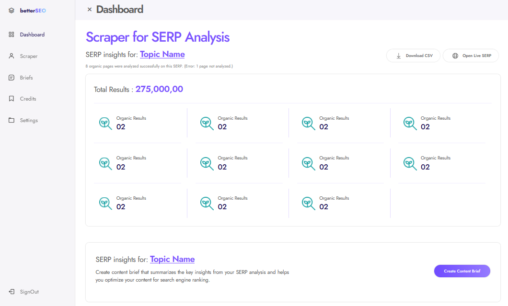

# Keyword SEO Pro

Welcome to Keyword SEO Pro, a dynamic showcase of my expertise in web development and SEO optimization. This project offers a comprehensive solution for analyzing keywords and enhancing website visibility through advanced analytics and SEO strategies.

## Project Overview

Keyword SEO Pro is built using a powerful stack including HTML5, CSS, Bootstrap, JavaScript, Python, and Laravel. It provides users with the ability to input keywords and receive detailed insights into their website's performance, including keyword usage and its impact on search engine rankings.

### Key Features

- **Keyword Analysis**: Gain valuable insights into keyword performance and its relevance to your website.
- **Technical SEO Insights**: Explore technical aspects affecting your website's SEO and discover optimization opportunities.
- **Premium Subscription**: Unlock advanced features like competitor analysis and custom SEO strategies by subscribing to the premium plan.
- **Responsive Design**: Enjoy a seamless user experience across various devices with our fully responsive design.

## Screenshots

## Getting Started

To get started with Keyword SEO Pro locally, follow these steps:

1. Clone the repository:
  git clone https://github.com/HamadRizwan007/keyword-seo-pro.git

2. Navigate to the project directory:
  cd keyword-seo-pro

3. Install dependencies (if applicable):
  npm install

5. Run the project:
  npm start

## Contributing

Contributions are welcome! If you have ideas, suggestions, or improvements for Keyword SEO Pro, feel free to open an issue or submit a pull request.

## License

This project is licensed under the [MIT License](LICENSE).
